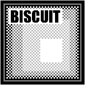

Biscuit is a bite-sized (haha) browser which performs the absolute minimum required to render a website.

It relies on the PyQt5, BeautifulSoup, and openai libraries.

## Running and Using Biscuit

`python biscuit.py`

Type in a url of your choice (you may omit http(s)://) click Go and start your browsing adventure! Resize the window as needed.

You may "AI-ify" the content displayed in the Biscuit window at any time by selecting the AI task from the dropdown menu (Summarize, Poetify, Roast, Praise) and clicking the "AI that shit" button. The contents of the Biscuit window will be replaced with the AI output. You may chain AI tasks (e.g. Roast the Poem of the Summary of a webpage). This functionality is dependent on an active OpenAI organization and project, the API keys to which you must include in `config.yaml`.

At any point you may save the Biscuit window content as a `.html` to local storage using the menu bar at the top of the window. There you may also toggle the theme from dark to light and back.

## Inspiration

For several years I have built a personal website of mine with the intentiion of using almost entirely html and css with as little javascript as possible in order to convey information with the most efficient idea/Watt ratio possible. These days if you want to look at a recipe for chocolate chip cookies, you are forced to download hundreds of megabytes of personalized adds, and scipts for popups and dialog boxes; a disgustingly large amount of bloat. If you are unfortunate enough to have a suboptimal internet connection, you wont be making cookies anytime soon. Websites sadly have no need to be "skinny". For the most part, a 200MB page loads fast enough for most people. But what a waste it is.

My website is easy to load, the biggest loads are the images whose sources I scale down to be less than a megabyte each at maximum. Most are a few dozen kilobytes. But even still, you have to access my website through a browser app (most likely Chrome) which yet again forces you to consume mountains of data whether you ask it to or not. Somehow, a single page of my website that is 2kB of html and css text consumes 200MB of memory in Chrome. I don't like that.

I also enjoy the idea of adding some whimsical elements to this simple contraption. I am esspecially inspired by the possibilities granted by easy access to LLMs and how goofy they can be. Too often I find myself trying desperately to extract utility from LLMs and I reject the notion of having any fun with them! Where's the fun in that? So, I added some optional functionality to Biscuit to choose your LLM prompt style, and then ship off the contents of the webpage you are currently looking at to summarize, poetify, or roast. I love the idea of being able to quickly lambast my friend's blogs, what a silly way to spend an afternoon.

## Aspiration

Biscuit in a way is a throwback to the old internet. There is no built-in search engine, you have to know the website address ahead of time. There's no javascript execution, (currently) no image rendering, and much much more (less?). I hope that in some strange way people will use Biscuit as a reason to build simple blogs. Places and pages for simple text, shareable quickly and cleanly in the most efficient way possible.

Biscuit is in its very early stages, there's several more things I want to add to it. If you like what you see, please feel free to fork and contribute.